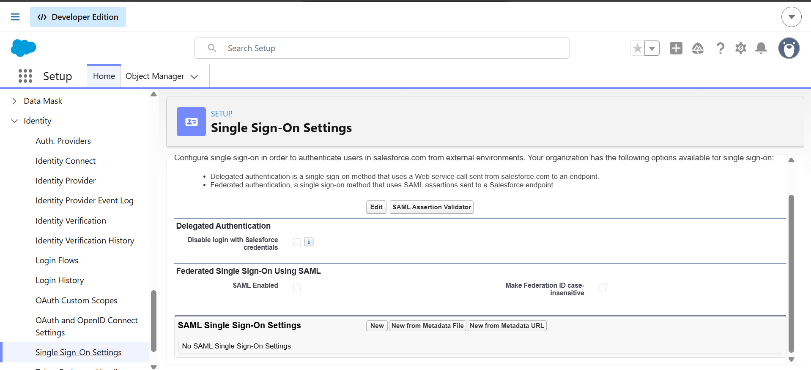
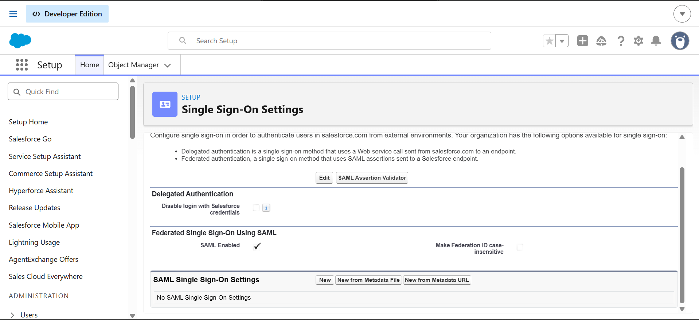
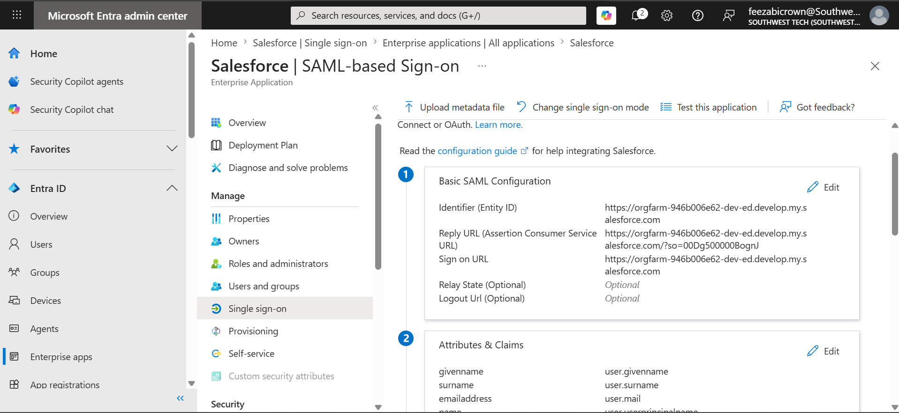
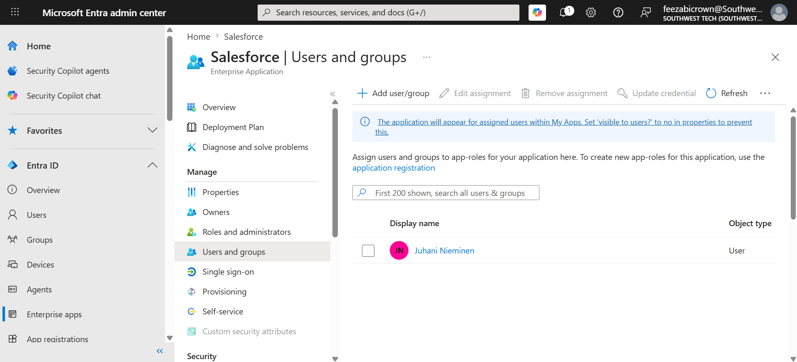
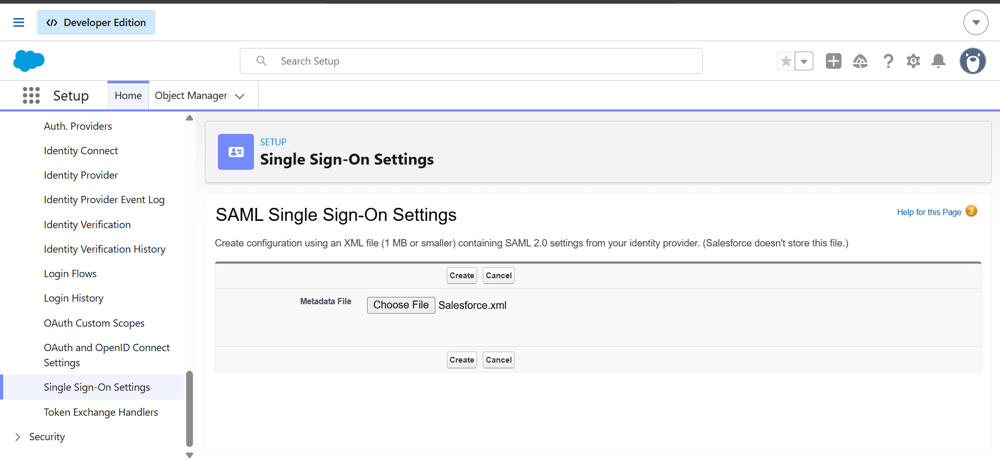
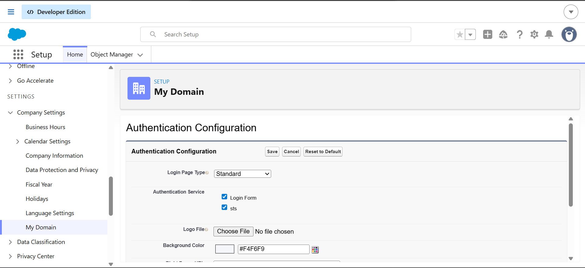
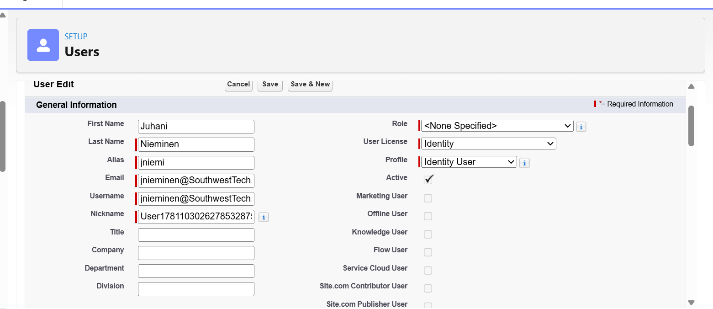
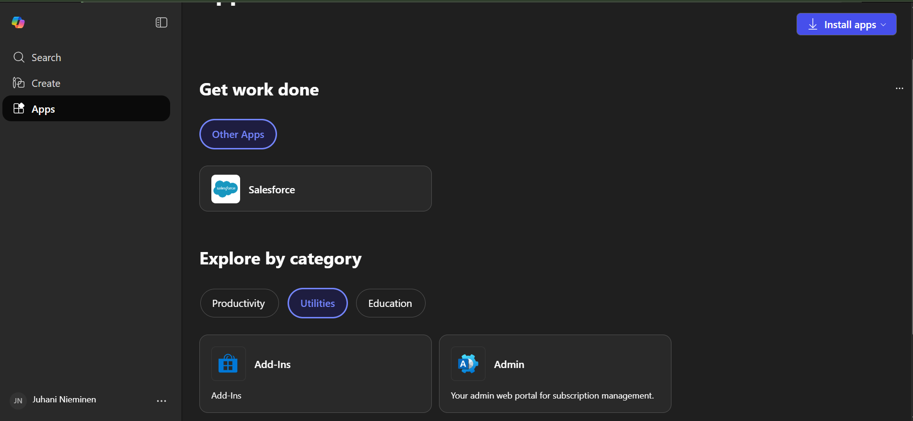
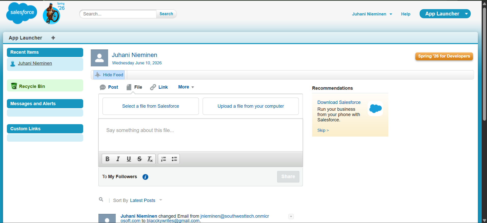

# **Configure SAML Single Sign-On for Salesforce**

### **Overview**

For this task, I configured SAML-based Single Sign-On (SSO) between Microsoft Entra ID and Salesforce. This configuration allows users to authenticate through Microsoft Entra ID and access Salesforce without maintaining a separate Salesforce password.

### **Objective**

-Configure Salesforce to use SAML authentication.

-Establish a trust relationship between Microsoft Entra ID and Salesforce.

-Prepare the environment for claims configuration and user assignment.

-Enable centralized authentication through Microsoft Entra ID.

## Step 1 — Open Salesforce Single Sign-On Configuration

I opened the Salesforce enterprise application in Microsoft Entra ID and navigated to the Single sign-on section.
I selected SAML as the authentication method to begin configuring federated authentication between Microsoft Entra ID and Salesforce.

## Step 2 — Open Salesforce Single Sign-On Settings
I opened the Salesforce Setup menu and navigated to Identity → Single Sign-On Settings to begin configuring Salesforce as a SAML Service Provider.

*Figure: Single sign-on settings page*

## Step 3 — Enable SAML Authentication

I opened Single Sign-On Settings in Salesforce and selected Edit to enable SAML authentication. This allowed Salesforce to accept SAML assertions from an external identity provider such as Microsoft Entra ID.

*Figure: Salesforce Single Sign-On Settings page with SAML enabled.*

## Step 4 — Configure Basic SAML Settings in Entra ID
I configured the required Basic SAML settings for the Salesforce enterprise application in Microsoft Entra ID. I used the Salesforce My Domain URL and Organization ID to build the Reply URL, which tells Entra where to send the SAML authentication response after sign-in.

*Figure: Salesforce Basic SAML settings configured in Microsoft Entra ID.*

## Step 5 — Download Federation Metadata XML

I downloaded the Federation Metadata XML file from Microsoft Entra ID. This file contains the SAML federation settings and signing certificate information required to establish trust between Salesforce and Microsoft Entra ID.

## Step 6 — Assign User to the Salesforce Enterprise Application
I assigned Juhani Nieminen to the Salesforce Enterprise Application in Microsoft Entra ID and granted the System Administrator application role. This allows the user to access Salesforce through SAML-based single sign-on.

*Figure: Assigned  Juhani Nieminen to the Salesforce Enterprise Application.*

## Step 7 — Import Federation Metadata

The Federation Metadata XML file downloaded from Microsoft Entra ID was imported into Salesforce. Salesforce automatically configured the identity provider settings, including the issuer URL, signing certificate, and SAML trust configuration required for federated authentication.

*Figure: Metadata XML file imported into Salesforce.*

## Step 8 — Save SAML Configuration
The imported SAML identity provider configuration was saved in Salesforce, creating a trusted federation relationship with Microsoft Entra ID.

## Step 9 — Enable Microsoft Entra Authentication Service
The Salesforce My Domain authentication configuration was updated to enable both the standard Salesforce login page and the Microsoft Entra SAML authentication service. This allows users to authenticate through Microsoft Entra ID while retaining access to the native Salesforce login page if required.

*Figure: Authentication services configured for Salesforce SAML single sign-on.*

## Step 10 - Create Salesforce Test User

I created a Salesforce test user account to validate Single Sign-On (SSO) authentication from Microsoft Entra ID. The user's Salesforce username was configured to match the corresponding Entra ID User Principal Name (UPN).

*Figure: Salesforce test user created for SAML SSO authentication testing.*

## Step 11 — Verify Access Through My Apps Portal
I signed in to Microsoft 365 as the test user Juhani Nieminen and accessed the My Apps portal. The Salesforce enterprise application was visible to the assigned user, confirming that the application assignment was successful and available for Single Sign-On testing.

*Figure: Salesforce application visible in My Apps for the Juhani Nieminen test user.*

## Step 12 — Verify Single Sign-On Authentication
I launched the Salesforce application from the Microsoft 365 My Apps portal while signed in as Juhani Nieminen. The application authenticated the user through Microsoft Entra ID and automatically granted access to Salesforce without requiring separate Salesforce credentials.

*Figure: Successful Salesforce Single Sign-On authentication using the Juhani Nieminen Entra ID account*

## Conclusion

I successfully configured SAML Single Sign-On (SSO) between Microsoft Entra ID and Salesforce. After assigning the user and testing the integration through Microsoft My Apps, Salesforce recognized the assigned Entra user, confirming that the SSO configuration was working as expected.

